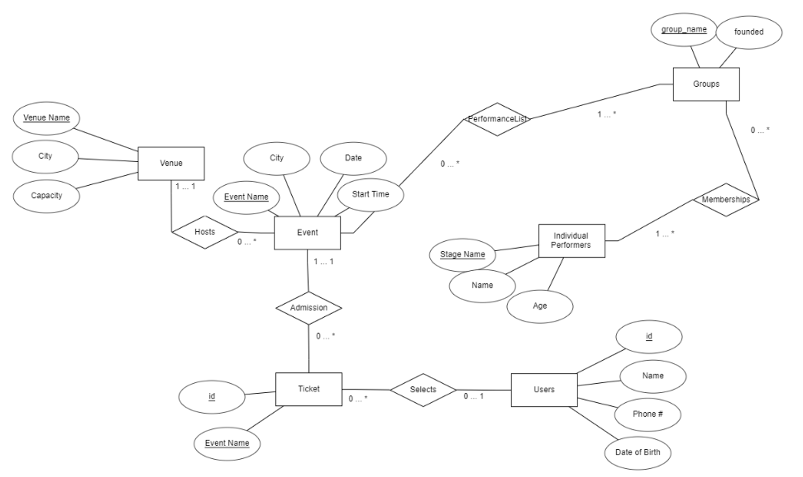

# Ticket Apprentice - Database Management System (12/3/23 Update)

A proof-of-concept ticket management system built with Python and Tkinter, demonstrating database operations and UI interactions. This project was created for the CPSC 321: Database Management Systems at Gonzaga University.

## Demo Video
[](https://www.youtube.com/watch?v=hr3miduw4tk)

## Database Schema
The application is built around a database schema for managing events, tickets, users, and performances. The system connects to a MariaDB database for all data storage and retrieval operations. Below is the Entity-Relationship diagram that illustrates the database structure:



The schema includes several interconnected entities:
- Users who can purchase tickets
- Events hosted at various venues
- Individual performers and groups
- Tickets with purchase tracking
- Venue information and capacity management

All database operations are handled through the MariaDB Python connector, providing reliable SQL interactions.

## Core Files

[`main.py`](https://github.com/dom-schulz/ticket-management-system/blob/main/main.py)
The entry point of the application, handling:
- UI initialization with Tkinter
- Tab-based navigation system
- Database connection management
- Dashboard with analytics (top users, revenue, etc.)

```python
# Example of dashboard analytics query
top_users_query = '''
WITH RankedUsers AS (
    SELECT
        u.id AS user_id,
        u.user_name,
        COUNT(t.id) AS ticket_count,
        SUM(t.price) AS total_spent,
        RANK() OVER (ORDER BY SUM(t.price) DESC) AS rank
    FROM Tickets t
    JOIN Users u ON t.purchased_by = u.id
    WHERE t.purchased_by IS NOT NULL
    GROUP BY u.id, u.user_name
)
SELECT user_id, user_name, ticket_count, total_spent
FROM RankedUsers
WHERE rank <= 10
ORDER BY total_spent DESC;
'''
```

[`populate_tables.sql`](https://github.com/dom-schulz/ticket-management-system/blob/main/populate_tables.sql)
Contains all the SQL statements for:
- Table creation
- Sample data insertion
- Database initialization

Note: The insert statements were generated using AI to create a comprehensive test dataset while maintaining referential integrity.


[`ticket_utils.py`](https://github.com/dom-schulz/ticket-management-system/blob/main/ticket_utils.py)
Contains the core functionality for ticket management and database operations. While functional, this file was completed in December 2023 and could benefit from improved organization and readability. The file handles:
- CRUD (Create, Read, Update, Delete) operations for all entities
- Search functionality
- UI element management
- Error handling and validation


[my_config.ini](https://github.com/dom-schulz/ticket-management-system/blob/main/my_config.ini)
Configuration file for database connection details:
```ini
[db_info]
host = your_host
user = your_username
password = your_password
database = your_database
```

## Features
- Admin dashboard with basic analytics
- Ticket search functionality
- User management system
- Event and venue management
- Performance and artist tracking
- Ticket purchase and tracking system

## Future Improvements

1. Code Organization
   - Refactor ticket_utils.py into smaller, more focused files
   - Implement proper separation of functionalities
   - Add comprehensive documentation

2. Infrastructure
   - Migrate to a cloud-hosted solution (ex. Node.js)
   - Implement proper authentication and authorization

3. User Interface
   - Improve the user interfacea and navigation
   - Add responsive design for different screen sizes

4. Additional Features
   - Real-time ticket availability updates
   - Email notifications for purchases
   - Payment processing integration
   - Reporting and analytics dashboard
   - Batch operations for bulk tickets